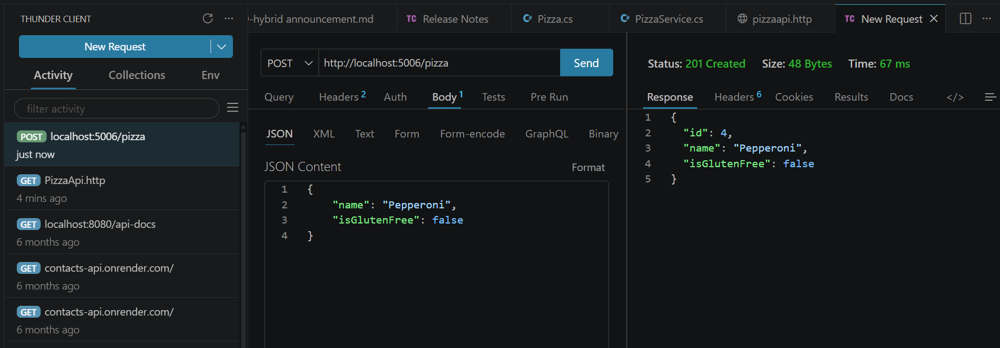
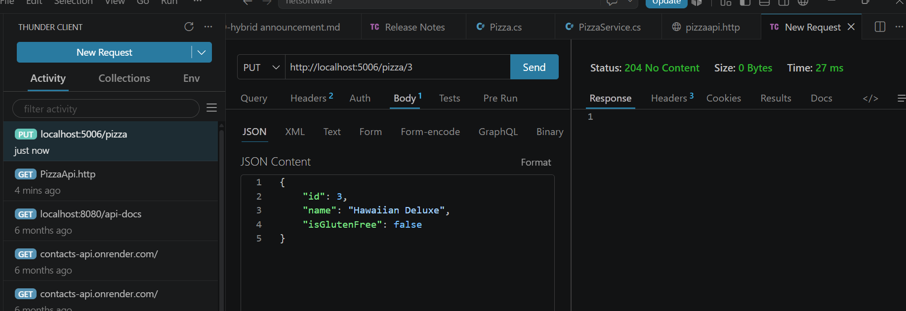
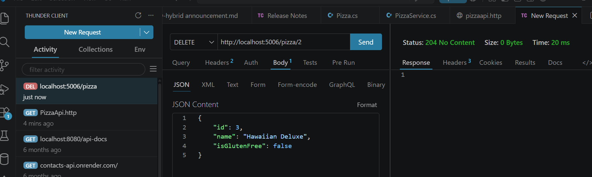
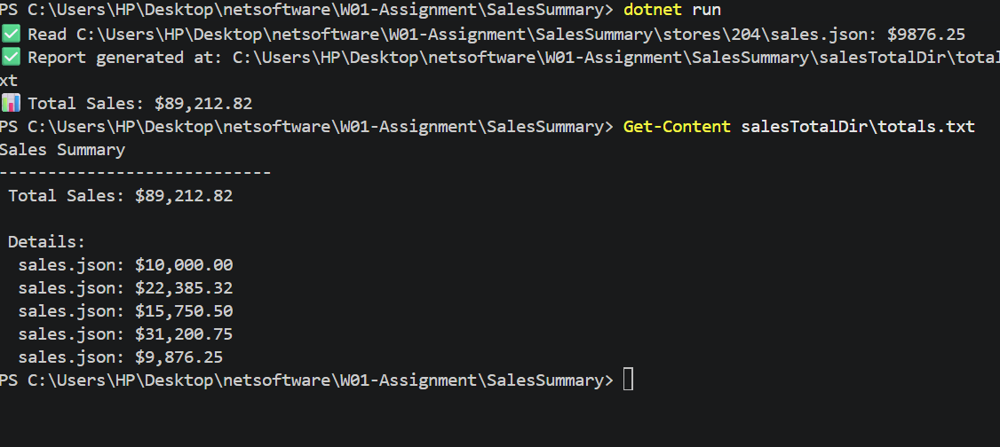

# W01 Assignment: Build .NET Applications with C#

## Student Information
- Course: CSE 325
- Week: 01
- Date: July 2, 2026

---

## Part 1: Microsoft Learn Modules Completed

I completed the following modules as part of the "Build .NET Applications with C#" learning path:

- [x] **Write your first C# code** - Learned C# syntax, variables, and basic operations
- [x] **Introduction to .NET** - Understood .NET architecture and ecosystem
- [x] **Create a new .NET project and work with dependencies** - Used dotnet CLI and NuGet packages
- [x] **Interactively debug .NET apps with VS Code** - Applied debugging techniques with breakpoints and call stack
- [x] **Work with files and directories in a .NET app** - Implemented file I/O operations
- [x] **Create a web API with ASP.NET Core controllers** - Built RESTful API with CRUD operations

**Total Learning Time:** Approximately 8-10 hours across all modules.

**Key Takeaways:**
- .NET provides a comprehensive ecosystem for building various types of applications
- NuGet makes it easy to manage external dependencies
- VS Code debugging tools are powerful for identifying and fixing bugs
- ASP.NET Core enables rapid development of RESTful web APIs

---

## Part 2A: Additional Pizza Record

Added pizza: **"Hawaiian"**
- Id: 3
- IsGlutenFree: false

---

## Part 2B: CRUD Testing Results

| Operation | Method | Endpoint | Status Code | Response |
|-----------|--------|----------|-------------|----------|
| Get All | GET | /pizza | 200 OK | All 3 pizzas including Hawaiian |
| Get by ID | GET | /pizza/1 | 200 OK | Classic Italian |
| Create | POST | /pizza | 201 Created | New pizza with ID 4 |
| Update | PUT | /pizza/3 | 204 No Content | Hawaiian → Hawaiian Deluxe |
| Delete | DELETE | /pizza/2 | 204 No Content | Veggie pizza removed |

---

### Screenshots - API Testing

**GET All - 200 OK**

**GET by ID - 200 OK**

**POST - 201 Created**

**PUT - 204 No Content**

**DELETE - 204 No Content**

---

## Part 2C: Sales Summary Function

The `GenerateSalesSummary()` function is located in `SalesSummary/Program.cs`.

### Screenshots - Sales Summary

**Sales Summary Console Output**

Below is the screenshot showing the successful execution of the SalesSummary console application. The program found all 5 JSON files, read each one, calculated the total sales, and generated the report.

### Terminal Output:
Found 5 JSON files:

./stores/sales.json

./stores/201/sales.json

./stores/202/sales.json

./stores/203/sales.json

./stores/204/sales.json

✅ Read ./stores/sales.json: $10000.00
✅ Read ./stores/201/sales.json: $22385.32
✅ Read ./stores/202/sales.json: $15750.50
✅ Read ./stores/203/sales.json: $31200.75
✅ Read ./stores/204/sales.json: $9876.25

✅ Report generated at: ./salesTotalDir/totals.txt
📊 Total Sales: $89,212.82

text

### Generated Report (totals.txt):
Sales Summary

Total Sales: $89,212.82

Details:
sales.json: $10,000.00
201\sales.json: $22,385.32
202\sales.json: $15,750.50
203\sales.json: $31,200.75
204\sales.json: $9,876.25

text

---

## Azure DevOps repository URL
https://ukolawole@dev.azure.com/ukolawole/W01-Assignment/_git/W01-Assignment

